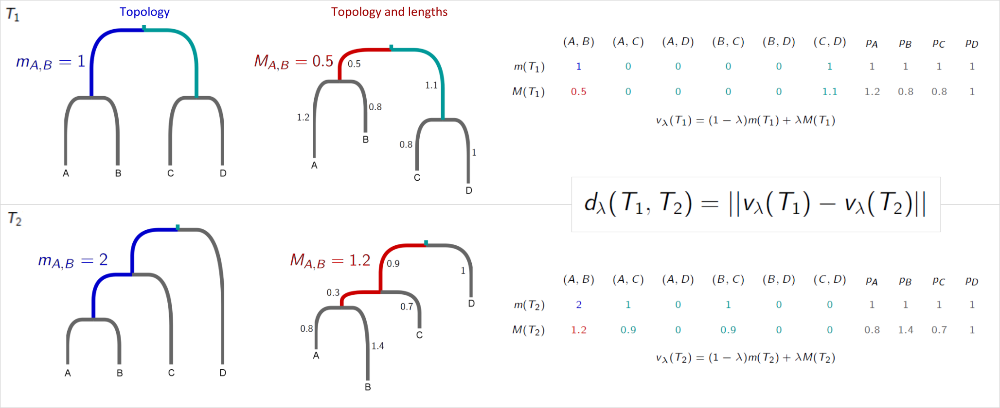

[](https://travis-ci.org/thibautjombart/treescape)
[](https://cran.r-project.org/package=treescape)
[](https://cran.r-project.org/package=treescape)


```{r setup, echo=FALSE}
# set global chunk options: images will be 7x5 inches
knitr::opts_chunk$set(fig.width=7, fig.height=7, fig.path="vignettes/figs/", cache=FALSE)
options(digits = 4)
```

*treescape*: exploration of landscapes of phylogenetic trees
=================================================
*treescape* implements new methods for the exploration and analysis of distributions of phylogenetic trees for a given set of taxa.


Installing *treescape*
-------------
To install the development version from github:
```{r install, eval=FALSE}
library(devtools)
install_github("thibautjombart/treescape")
```

The stable version can be installed from CRAN using:
```{r install2, eval=FALSE}
install.packages("treescape")
```

Then, to load the package, use:
```{r load}
library("treescape")
```


Content overview
-------------
The main functions implemented in *treescape* are:
* __`treescape`__: explore landscapes of phylogenetic trees
* __`treescapeServer`__: open up an application in a web browser for an interactive exploration of the diversity in a set of trees
* __`findGroves`__: identify clusters of similar trees
* __`plotGroves`__: scatterplot of groups of trees, and __`plotGrovesD3`__ which enables interactive plotting based on d3.js
* __`medTree`__: find geometric median tree(s) to summarise a group of trees

Other functions are central to the computations of distances between trees:
* __`treeVec`__: characterise a tree by a vector
* __`treeDist`__: find the distance between two tree vectors
* __`multiDist`__: find the pairwise distances of a list of trees
* __`refTreeDist`__: find the distances of a list of trees from a reference tree
* __`tipDiff`__: for a pair of trees, list the tips with differing ancestry
* __`plotTreeDiff`__: plot a pair of trees, highlighting the tips with differing ancestry


Distributed datasets include:
* __`woodmiceTrees`__: illustrative set of 201 trees built using the neighbour-joining and bootstrapping example from the *woodmice* dataset in the *ape* documentation.
* __`DengueTrees`__: 500 trees sampled from a BEAST posterior set of trees from (Drummond and Rambaut, 2007)
* __`DengueSeqs`__: 17 dengue virus serotype 4 sequences from (Lanciotti *et al.*, 1997), from which the `DengueTrees` were inferred.
* __`DengueBEASTMCC`__: the maximum clade credibility (MCC) tree from the `DengueTrees`.


Exploring trees with *treescape*
--------------

We first load *treescape*, and the packages required for graphics:
```{r load_packages, message=FALSE, warning=FALSE}
library("treescape")
library("adegenet")
library("adegraphics")
library("ggplot2")
```

The function `treescape` defines typologies of phylogenetic trees using a two-step approach:

1. perform pairwise comparisons of trees using various (Euclidean) metrics; by default, the comparison uses the Kendall and Colijn metric (Kendall and Colijn, 2016) which is described in more detail below; other metrics rely on tip distances implemented in *adephylo* (Jombart *et al.*, 2010) and *phangorn* (Schliep 2011).

2. use Metric Multidimensional Scaling (MDS, aka Principal Coordinates Analysis, PCoA) to summarise pairwise distances between the trees as well as possible into a few dimensions; the output of the MDS is typically visualised using scatterplots of the first few Principal Components (PCs); this step relies on the PCoA implemented in *ade4* (Dray and Dufour, 2007).

The function `treescape` performs both tasks, returning both the matrix of pairwise tree comparisons (`$D`), and the PCoA (`$pco`).
This can be illustrated using randomly generated trees:
```{r treescape}
# generate list of trees
set.seed(1)
x <- rmtree(10, 20)
names(x) <- paste("tree", 1:10, sep = "")

# use treescape
res <- treescape(x, nf=3)
names(res)
res
```

Pairwise tree distances can be visualised using *adegraphics*:
```{r distances_readme}
# table.image
table.image(res$D, nclass=30)

# table.value with some customization
table.value(res$D, nclass=5, method="color", 
            symbol="circle", col=redpal(5))

```

The best representation of these distances in a 2-dimensional space is given by the first 2 PCs of the MDS.
These can be visualised using any scatter plotting tool; here we use the *treescape* function `plotGroves`, based on the *adegraphics* function `scatter`:

```{r plotgroves_readme}
plotGroves(res$pco, lab.show=TRUE, lab.cex=1.5)
```

The functionality of `treescape` can be further illustrated using *ape*'s dataset *woodmouse*, from which we built the 201 trees supplied in `woodmiceTrees` using the neighbour-joining and bootstrapping example from the *ape* documentation. 
```{r woodmicePlots_readme}
data(woodmiceTrees)
wm.res <- treescape(woodmiceTrees,nf=3)

# PCs are stored in:
head(wm.res$pco$li)

# plot results
plotGroves(wm.res$pco)

# visualising density of points
s.kde2d(wm.res$pco$li)

# alternative using ggplot2
woodmiceplot <- ggplot(wm.res$pco$li, aes(x=A1, y=A2)) # create plot
woodmiceplot + geom_density2d(colour="gray80") + # contour lines
geom_point(size=6, shape=1, colour="gray50") + # grey edges
geom_point(size=6, alpha=0.2, colour="navy") + # transparent blue points
xlab("") + ylab("") + theme_bw(base_family="") # remove axis labels and grey background
```

Interactive plots are also available using `plotGrovesD3` and *rgl*'s `plot3d`.

Note that alternatively, the function `multiDist` simply performs the pairwise comparison of trees and outputs a distance matrix. 
This function may be preferable for large datasets, and when principal co-ordinate analysis is not required. 
It includes an option to save memory at the expense of computation time.


Identifying clusters of trees
--------------
Once a typology of trees has been derived using the approach described above, one may want to formally identify clusters of similar trees.
One simple approach is:

1. select a few first PCs of the MDS (retaining signal but getting rid of random noise)

2. derive pairwise Euclidean distances between trees based on these PCs

3. use hierarchical clustering to obtain a dendrogram of these trees

4. cut the dendrogram to obtain clusters
 
In *treescape*, the function `findGroves` implements this approach, offering various clustering options (see `?findGroves`). Here we supply the function with our `treescape` output `wm.res` since we have already calculated it, but it is also possible to skip the steps above and directly supply `findGroves` with a multiPhylo list of trees.
```{r findgroves, cache=FALSE}
wm.groves <- findGroves(wm.res, nclust=6)
names(wm.groves)
```
Note that when the number of clusters (`nclust`) is not provided, the function will display a dendrogram and ask for a cut-off height. 

The results can be plotted directly using `plotGroves` (see `?plotGroves` for options):
```{r plotgroves2_readme}
# basic plot
plotGroves(wm.groves)

# alternative with inertia ellipses
plotGroves(wm.groves, type="ellipse")

# plot axes 2 and 3. This helps to show why, for example, clusters 2 and 4 have been identified as separate, despite them appearing to overlap when viewing axes 1 and 2.
plotGroves(wm.groves, xax=2, yax=3)
```


`treescapeServer`: a web application for *treescape*
--------------
The functionalities of `treescape` are also available via a user-friendly web interface, running locally on the default web browser.
It can be started by simply typing `treescapeServer()`.
The interface allows you to import trees and run `treescape` to view and explore the tree space in 2 or 3 dimensions.
It is then straightforward to analyse the tree space by varying lambda, looking for clusters using `findGroves` and saving results in various formats.
Individual trees can be easily viewed including median trees per cluster, and collections of trees can be seen together using `densiTree` from the package `phangorn`.
**It is fully documented in the *help* tab.**


Finding median trees
--------------

When a set of trees have very similar structures, it makes sense to summarize them into a single 'consensus' tree.
In `treescape`, this is achieved by finding the *median tree* for a set of trees according to the Kendall and Colijn metric.
That is, we find the tree which is closest to the centre of the set of trees in the tree landscape defined in `treescape`.
This procedure is implemented by the function `medTree`:

```{r woodmiceMedian_readme}
# get first median tree
tre <- medTree(woodmiceTrees)$trees[[1]]

# plot tree
plot(tre,type="cladogram",edge.width=3, cex=0.8)
```

However, a more complete and accurate summary of the data can be given by finding a summary tree from each cluster.
This is achieved using the `groups` argument of `medTree`:
```{r woodmiceCluster1_readme, out.width="600px"}
# find median trees for the 6 clusters identified earlier:
res <- medTree(woodmiceTrees, wm.groves$groups)

# there is one output per cluster
names(res)

# get the first median of each
med.trees <- lapply(res, function(e) ladderize(e$trees[[1]]))

# plot trees
par(mfrow=c(2,3))
for(i in 1:length(med.trees)) plot(med.trees[[i]], main=paste("cluster",i),cex=1.5)

```

These trees exhibit a number of topological differences, e.g. in the placement of the **(1007S,1208S,0909S)** clade. 
To examine the differences between the trees in a pairwise manner, we can use the function `plotTreeDiff`, for example:

```{r woodmice_plotTreeDiff_readme}
# Compare median trees from clusters 1 and 2:
plotTreeDiff(med.trees[[1]],med.trees[[2]], use.edge.length=FALSE)
# Compare median trees from clusters 1 and 4, and change aesthetics:
plotTreeDiff(med.trees[[1]],med.trees[[4]], type="cladogram", use.edge.length=FALSE, edge.width=2, colourMethod="palette",palette=spectral)
```

Performing this analysis enables the detection of distinct representative trees supported by data.

Note that in this example we supplied the function `medTree` with the multiPhylo list of trees. A more computationally efficient process (at the expense of using more memory) is to use the option `return.tree.vectors` in the initial `treescape` call, and then supply these vectors directly to `medTree`.
In this case, the tree indices are returned by `medTree` but the trees are not (since they were not supplied).

Emphasising the placement of certain tips or clades
--------------

In some analyses it may be informative to emphasise the placement of particular tips or clades within a set of trees. This can be particularly useful in large trees where the study is focused on a smaller clade. Priority can be given to a list of tips using the argument `emphasise.tips`, whose corresponding values in the vector comparison will be given a weight of `emphasise.weight` times the others (the default is 2, i.e. twice the weight).

For example, if we wanted to emphasise where the woodmice trees agree and disagree on the placement of the **(1007S,1208S,0909S)** clade, we can simply emphasise that clade as follows: 
```{r woodmice-tip-emphasis_readme}
wm3.res <- treescape(woodmiceTrees,nf=2,emphasise.tips=c("No1007S","No1208S","No0909S"),emphasise.weight=3)

# plot results
plotGroves(wm3.res$pco)
```

It can be seen from the scale of the plot and the density of clustering that the trees are now separated into more distinct clusters.
```{r findgroves-with-emphasis_readme}
wm3.groves <- findGroves(woodmiceTrees,nf=3,nclust=6,emphasise.tips=c("No1007S","No1208S","No0909S"),emphasise.weight=3)
plotGroves(wm3.groves, type="ellipse")
```

Conversely, where the structure of a particular clade is not of interest (for example, lineages within an outgroup which was only included for rooting purposes), those tips can be given a weight less than 1 so as to give them less emphasis in the comparison. We note that although it is possible to give tips a weighting of 0, we advise caution with this as the underlying function will no longer be guaranteed to be a metric. That is, a distance of 0 between two trees will no longer necessarily imply that the trees are identical. In most cases it would be wiser to assign a very small weighting to tips which are not of interest.

Method: characterising a tree by a vector
--------------
Kendall and Colijn proposed a [metric](http://dx.doi.org/10.1093/molbev/msw124) for comparing rooted phylogenetic trees (Kendall and COlijn, 2016). Each tree is characterised by a vector which notes the placement of the most recent common ancestor (MRCA) of each pair of tips, as demonstrated in this example:




Specifically, it records the distance between the MRCA of a pair of tips *(i,j)* and the root in two ways: the number of edges *m(i,j)*, and the path length *M(i,j)*. It also records the length *p(i)* of each 'pendant' edge between a tip *i* and its immediate ancestor. This procedure results in two vectors for a tree *T*:

*m(T) = (m(1,2), m(1,3),...,m(k-1,k),1,...,1)*

and

*M(T) = (M(1,2), M(1,3),...,M(k-1,k),p(1),...,p(k)).*

In *m(T)* we record the pendant lengths as 1, as each tip is 1 step from its immediate ancestor. We combine *m* and *M* with a parameter lambda between zero and one to weight the contribution of branch lengths, characterising each tree with a vector 

*v{lambda}(T) = (1-lambda)m(T) + lambda M(T)*.

This is implemented as the function __`treeVec`__. For example,
```{r treevec}
# generate a random tree:
tree <- rtree(6)
# topological vector of mrca distances from root:
treeVec(tree)
# vector of mrca distances from root when lambda=0.5:
treeVec(tree,0.5)
# vector of mrca distances as a function of lambda:
vecAsFunction <- treeVec(tree,return.lambda.function=TRUE)
# evaluate the vector at lambda=0.5:
vecAsFunction(0.5)
```

The metric -- the distance between two trees -- is the Euclidean distance between these vectors:

*d{lambda}(Ta, Tb) = || v{lambda}(Ta) - v{lambda}(Tb) ||.*


This can be found using __`treeDist`__:
```{r treedist}
# generate random trees
tree_a <- rtree(6)
tree_b <- rtree(6)

# topological (lambda=0) distance:
treeDist(tree_a,tree_b) 

# branch-length focused (lambda=1) distance:
treeDist(tree_a,tree_b,1)
```


References
--------------
* Dray, S. and Dufour, A. B. (2007) The ade4 package: implementing the duality diagram for ecologists. Journal of Statistical Software 22(4): 1-20.

* Drummond, A. J. and Rambaut, A. (2007) 
BEAST: Bayesian evolutionary analysis by sampling trees.
BMC Evolutionary Biology, 7(1), 214.

* Jombart, T., Balloux, F. and Dray, S. (2010) adephylo: new tools for investigating the phylogenetic signal in biological traits. Bioinformatics 26: 1907-1909. DOI: 10.1093/bioinformatics/btq292

* Kendall, M. and Colijn, C. (2016) Mapping phylogenetic trees to reveal distinct patterns of evolution. Molecular Biology and Evolution, first published online: June 24, 2016. DOI: 10.1093/molbev/msw124

* Lanciotti, R. S., Gubler, D. J. and Trent, D. W. (1997)
Molecular evolution and phylogeny of dengue-4 viruses.
Journal of General Virology, 78(9), 2279-2286.

* Schliep, K. P. (2011) phangorn: phylogenetic analysis in R. Bioinformatics 27(4): 592-593. 


Authors / Contributors
--------------
Authors:
* [Thibaut Jombart](https://sites.google.com/site/thibautjombart/)
* [Michelle Kendall](http://www.imperial.ac.uk/people/m.kendall)

Contributors:
* [Jacob Almagro-Garcia](http://www.well.ox.ac.uk/jacob-almagro-garcia)
* [Caroline Colijn](http://www.imperial.ac.uk/people/c.colijn)

Maintainer of the CRAN version:
* [Michelle Kendall](http://www.imperial.ac.uk/people/m.kendall)
